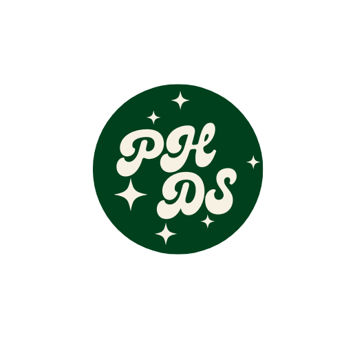

<a name="readme-top"/>

<br/>

<br />
<div align="center">
  <a href="https://github.com/Hermayni">


  </a>
  <h3 align="center">WD - MIDTERMS</h3>
</div>
<div align="center">
 Copy given landing page
</div>

<br />


---

<br />
<br />


<details>
  <summary>Table of Contents</summary>
  <ol>
    <li>
      <a href="#overview">Overview</a>
      <ol>
        <li>
          <a href="#key-components">Key Components</a>
        </li>
        <li>
          <a href="#technology">Technology</a>
        </li>
      </ol>
    </li>
    <li>
      <a href="#rules-and-principles">Rules and Principles</a>
    </li>
    <li>
      <a href="#resources">Resources</a>
    </li>
  </ol>
</details>

---

## Overview


Description of the project in details.

Guiding Question:
- What is the project
   <br>
  The project involves creating a landing page based on provided designs and specifications. This task is designed to assess the student's understanding and expertise in web development, specifically focusing on HTML and CSS.
   <br>
   <br>
-  Whats the purpose
<br>
The primary purpose of this project is to evaluate the student's proficiency in web development by asking them to program a given landing page. This will help the instructor to understand the student's ability to: 
<br>
<ul>
           <li>Write clean, organized, and well-formatted HTML and CSS code</li>
           <li>Implement design specifications accurately</li>
          <li>Demonstrate an understanding of responsive design principles</li>
          <li>Create cross-browser compatible web pages</li>
<br>
<br>
- What are key components
<br>
The key components of this project include:

Structure: Creating a well-organized HTML structure that follows semantic best practices.<br>
Styling: Implementing the design using CSS, ensuring proper layout, typography, colors, and other visual elements.<br>
Responsiveness: Designing the landing page to be responsive, meaning it adapts to various screen sizes and devices.<br>
Cross-browser compatibility: Ensuring the landing page displays correctly in different browsers, such as Google Chrome, Firefox, Safari, and Microsoft Edge.
<br>
<br>
- What technology used and how it is used
<br>
HTML and CSS


### Key Components

<ul>
  <li>Header</li>
  <li>Sections</li>
  <li>Content</li>
  <li>Styling</li>
  <li>Responsive Design</li>
  <li>Icons and Images</li>
  <li>Contact Form</li>
</ul>


### Technology


## Rules and Principles
1. Always use ***WD-*** in the Title of the Project for the Subject
2. Do not rename any .html files; always use 'index.html' as the filename.
3. File Structure to follow

```
WD-ProjectName
└─ assets
|   └─ css
|   |   └─ style.css
|   └─ js
|   |   └─ script.js
|   └─ img
|       └─ fileWith.jpeg/.jpg/.webp/.png
└─ pages
|  └─ pageName
|     └─ index.html
|     └─ assets
|        └─ css
|        |  └─ style.css
|        └─ js
|        |  └─ script.js
|        └─ img
|           └─ fileWith.jpeg/.jpg/.webp/.png
└─ index.html
└─ readme.md
```

## Resources


| Title | Purpose | Link |
|-|-|-|
| n/a | n/a  | n/a 